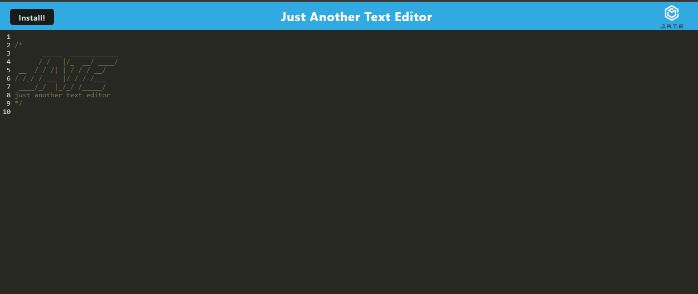

# PWA Text Editor

## Description
A text editor app that runs in the browser. This is a single-page application that meets PWA criteria and functions offline.

To build this text editor, you will start with an existing application and implement methods for getting and storing data to an IndexedDB database. You will use a package called idb, which is a lightweight wrapper around the IndexedDB API. It features a number of methods that are useful for storing and retrieving data, and is used by companies like Google and Mozilla.



## Technologies Used
```
Node.JS
Webpack PWA 
Workbox
```
## Links
```
Heroku: https://pure-chamber-19414-fe72f4e0299c.herokuapp.com/
GitHub: https://github.com/dizzymouse0/pwa-text-editor
```
